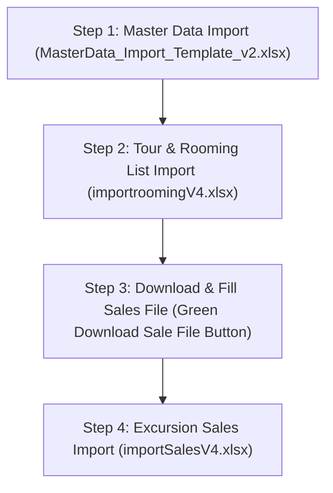

# 📘 UNO ERP - Comprehensive Excel Import Workflow & Step-by-Step Guide

This guide details the complete Excel Import workflow in UNO ERP. It explains **which file must be imported first**, the mandatory sequence of steps, data dependencies, and how the AI Assistant helps users navigate the import process.

---

## 🎯 **Overview of the 3 Official Import Files**

To ensure 100% data integrity without missing foreign key references, UNO ERP uses **3 official template files** stored in `C:\Ersen\Projects_2025\Uno_ERP\Publish\260829\importfiles\`:

1. **`MasterData_Import_Template_v2.xlsx`** $\rightarrow$ *Master Data (Hotels, Guides, Transport, Drivers, Excursions)*
2. **`Orta Avrupa -BVP_PVB05072026_importroomingV4.xlsx`** $\rightarrow$ *Tour & Passenger Rooming List*
3. **`Orta Avrupa -BVP_PVB05072026_importSalesV4.xlsx`** $\rightarrow$ *Excursion Sales & Base Services Report*

---

## 🔄 **Mandatory Step-by-Step Import Workflow**

---

### 1️⃣ **STEP 1 (ALWAYS FIRST): Master Data Import**
> [!IMPORTANT]
> **Why First?** Tours, hotels, excursion calculations, transport, and guide assignments rely on pre-existing Master Data. If you try to import a rooming file before importing hotels, the system will not be able to match hotel names or pricing rates.

* **File Name**: `MasterData_Import_Template_v2.xlsx`
* **Target Screen**: Navigation Sidebar $\rightarrow$ **Master Data** $\rightarrow$ Click **Import Master Data** button.
* **What it Imports**:
  * **Hotels Sheet**: Hotel Name, Location, Star Rating, **Pricing Basis (`Pax` vs `Room`)**, Single Room & Pax Rates, Double Room & Pax Rates, Twin Room & Pax Rates, Triple Room & Pax Rates, Contact Person, Email, and Phone.
  * **Guides Sheet**: Guide Names, Languages spoken, Daily Rates, Phone Numbers.
  * **Transport Sheet**: Bus/Transport Companies, Daily Rates, Fleet Size, Contact Details.
  * **Drivers Sheet**: Driver Names, Assigned Transport Companies, Phone Numbers, Daily Rates.
  * **Excursions Sheet**: Excursion Names, Cities, Vendor Names, Adult/Child Costs, and Selling Prices.

---

### 2️⃣ **STEP 2: Tour & Passenger Rooming List Import**
> [!NOTE]
> Once Master Data is loaded, you import the tour contract, project, and passenger rooming list.

* **File Name**: `Orta Avrupa -BVP_PVB05072026_importroomingV4.xlsx`
* **Target Screen**: Navigation Sidebar $\rightarrow$ **Tours** (or **Projects**) $\rightarrow$ Click **Import Rooming List**.
* **What it Creates & Imports**:
  * **Projects Sheet**: Creates/resolves the Project (e.g. `PRJ-BVP1` / `Tests 20260829`).
  * **Tours Sheet**: Creates the Tour (`BVP05072026`) and automatically sets its initial status to **`Draft` (`TourStatusId = 1` / First Status on Dashboard)**.
  * **Rooming Sheet**: Imports all 30 Passengers, groups family bookings (`BKG-01` to `BKG-15`), assigns `Room Numbers`, maps `Pax Type` (`Adult`, `Children`, `Infant`), and attaches child badges.
  * **Hotels Sheet**: Links the tour itinerary stays across Budapest, Vienna, and Prague.

---

### 3️⃣ **STEP 3: Download Pre-populated Sales Template**
> [!TIP]
> After importing the Rooming List in Step 2, you can download a **pre-populated sales template** containing the exact passenger list for that specific tour!

* **How to Download**:
  1. Open the Tour Details page.
  2. Click the **Bookings** tab.
  3. Click the green **`Download Sale File`** button next to the search input.
* **Output File**: Generates `{ProjectCode}_{TourCode}_importSales.xlsx` (e.g. `PRJ-BVP1_PVB05072026_importSales.xlsx`).
* **Contents**: Pre-populates all passenger names (with red font + `(CHD)` badge for children) and interactive drop-down checkboxes (`☐` / `☑`) for every excursion.

---

### 4️⃣ **STEP 4: Excursion Sales & Base Services Import**
> [!NOTE]
> After the guide or tour leader marks which passengers attended which excursions, upload the completed sales file.

* **File Name**: `Orta Avrupa -BVP_PVB05072026_importSalesV4.xlsx` (or the downloaded sale file).
* **Target Screen**: Tour Details page $\rightarrow$ **Services** tab $\rightarrow$ Click **Import Excursion Sales**.
* **What it Calculates & Imports**:
  * **ExcusionSales Sheet**: Parses `☑` checked boxes, calculates total quantities per excursion, creates Revenue and Expense lines for the tour.
  * **Guide Commission**: **Strictly calculates 10% of total excursion sales**. If no excursions are sold (or total sales $= 0$), Guide Commission is strictly set to **€0.00**.
  * **BaseServices Sheet**: Imports agency fees and city tax entries.

---

## 🤖 **AI Assistant Query Quick Reference**

When users ask the AI Assistant about Excel imports, the assistant references the following rules:

| User Question | AI Assistant Answer |
| :--- | :--- |
| **"Which Excel file do I import first?"** | You MUST import **`MasterData_Import_Template_v2.xlsx` FIRST** under the Master Data menu to establish hotels, rates, guides, and excursions before importing tours. |
| **"What file do I use for Rooming lists?"** | Use **`Orta Avrupa -BVP_PVB05072026_importroomingV4.xlsx`**. It creates the project, sets the tour status to **Draft**, and imports passengers with room numbers. |
| **"Where do I get the Excursion Sales file?"** | Click the green **`Download Sale File`** button on the **Bookings** tab of the tour page. Fill the checkboxes (`☑`), then import it back via the **Services** tab. |
| **"What status will my imported tour have?"** | All imported tours automatically start at the **first dashboard status (`TourStatusId = 1` / Draft)**. |

---

## 📁 **File Storage Locations**

All official import templates and documentation are preserved in:
* **Import Templates Directory**: [`C:\Ersen\Projects_2025\Uno_ERP\Publish\260829\importfiles\`](file:///C:/Ersen/Projects_2025/Uno_ERP/Publish/260829/importfiles/)
* **AI Knowledge User Manuals Directory**: [`C:\Ersen\Projects_2025\Uno_ERP\UserManuals\EXCEL_IMPORT_WORKFLOW_GUIDE.md`](file:///C:/Ersen/Projects_2025/Uno_ERP/UserManuals/EXCEL_IMPORT_WORKFLOW_GUIDE.md)
