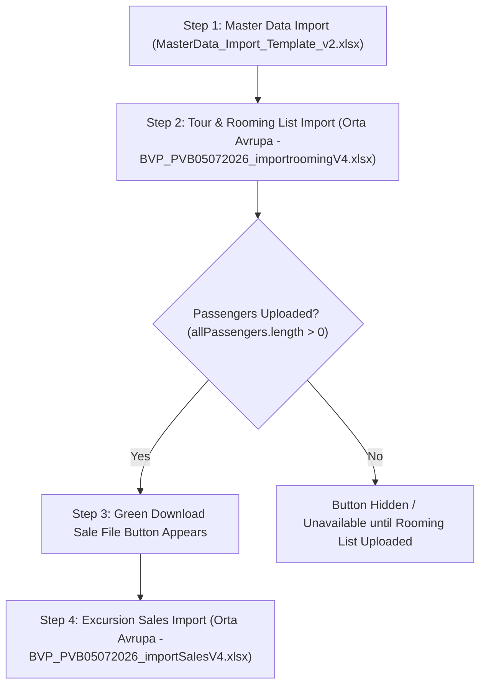

# 📘 UNO ERP - Comprehensive Excel Import Workflow & Step-by-Step Guide

This guide details the complete Excel Import workflow in UNO ERP. It explains **which file must be imported first**, the mandatory sequence of steps, data dependencies, passenger list prerequisites, and how to import sales Excel files.

---

## 🎯 **Overview of the 3 Official Import Files**

To ensure 100% data integrity without missing foreign key references, UNO ERP uses **exactly 3 official template files** located on the shared drive:

📂 **Shared Drive Location**: `Shared Drive/UnoERP/ExcelImportFiles/`

1. **`MasterData_Import_Template_v2.xlsx`** $\rightarrow$ *Master Data (Hotels, Guides, Transport, Drivers, Excursions)*
2. **`Orta Avrupa -BVP_PVB05072026_importroomingV4.xlsx`** $\rightarrow$ *Tour & Passenger Rooming List*
3. **`Orta Avrupa -BVP_PVB05072026_importSalesV4.xlsx`** $\rightarrow$ *Excursion Sales & Base Services Report*

---

## 🔄 **Mandatory Step-by-Step Import Workflow**

---

## 1️⃣ **How to Import Master Data Excel File (STEP 1 - ALWAYS FIRST)**
> [!IMPORTANT]
> **Why First?** Tours, hotels, excursion calculations, transport, and guide assignments rely on pre-existing Master Data. If you try to import a rooming file before importing hotels, the system will not be able to match hotel names or pricing rates.

* **File Name**: `MasterData_Import_Template_v2.xlsx`
* **File Location**: `Shared Drive/UnoERP/ExcelImportFiles/MasterData_Import_Template_v2.xlsx`
* **Target Screen**: Navigation Sidebar $\rightarrow$ **Master Data** $\rightarrow$ Click **Import Master Data** button.
* **What it Imports**:
  * **Hotels Sheet**: Hotel Name, Location, Star Rating, **Pricing Basis (`Pax` vs `Room`)**, Single Room & Pax Rates, Double Room & Pax Rates, Twin Room & Pax Rates, Triple Room & Pax Rates, Contact Person, Email, and Phone.
  * **Guides Sheet**: Guide Names, Languages spoken, Daily Rates, Phone Numbers.
  * **Transport Sheet**: Bus/Transport Companies, Daily Rates, Fleet Size, Contact Details.
  * **Drivers Sheet**: Driver Names, Assigned Transport Companies, Phone Numbers, Daily Rates.
  * **Excursions Sheet**: Excursion Names, Cities, Vendor Names, Adult/Child Costs, and Selling Prices.

---

## 2️⃣ **How to Import Tour & Rooming List Excel File (STEP 2)**
> [!NOTE]
> Once Master Data is loaded, you import the tour contract, project, and passenger rooming list.

* **File Name**: `Orta Avrupa -BVP_PVB05072026_importroomingV4.xlsx`
* **File Location**: `Shared Drive/UnoERP/ExcelImportFiles/Orta Avrupa -BVP_PVB05072026_importroomingV4.xlsx`
* **Target Screen**: Navigation Sidebar $\rightarrow$ **Tours** (or **Projects**) $\rightarrow$ Click **Import Rooming List**.
* **What it Creates & Imports**:
  * **Projects Sheet**: Creates/resolves the Project (e.g. `PRJ-BVP1` / `Tests 20260829`).
  * **Tours Sheet**: Creates the Tour (`BVP05072026`) and automatically sets its initial status to **`Draft` (`TourStatusId = 1` / First Status on Dashboard)**.
  * **Rooming Sheet**: Imports all 30 Passengers, groups family bookings (`BKG-01` to `BKG-15`), assigns `Room Numbers`, maps `Pax Type` (`Adult`, `Children`, `Infant`), and attaches child badges.

---

## 3️⃣ **How to Download Pre-populated Sales Template**
> [!IMPORTANT]
> **Green Button Availability**: The green **`Download Sale File`** button will **ONLY** appear once the passenger rooming list has been uploaded and passengers exist for the tour (`allPassengers.length > 0`). If no rooming list has been uploaded yet, the download button is hidden.

* **How to Download**:
  1. Open the Tour Details page.
  2. Click the **Bookings** tab.
  3. Click the green **`Download Sale File`** button next to the search input.
* **Output File**: Generates `{ProjectCode}_{TourCode}_importSales.xlsx` (e.g. `PRJ-BVP1_PVB05072026_importSales.xlsx`).
* **Detailed Passenger Pre-population**:
  * Automatically populates **all passengers in full detail** row by row.
  * Children under 18 are highlighted in **red font with a `(CHD)` badge**.
  * Renders interactive drop-down checkboxes (`☐` / `☑`) for every excursion across all passengers.

---

## 4️⃣ **How to Import Sales Excel File (Excursion Sales & Base Services)**
> [!NOTE]
> Follow these exact steps to import excursion sales and base services from an Excel file into UNO ERP.

* **File Name**: `Orta Avrupa -BVP_PVB05072026_importSalesV4.xlsx` (or the downloaded sale file).
* **File Location**: `Shared Drive/UnoERP/ExcelImportFiles/Orta Avrupa -BVP_PVB05072026_importSalesV4.xlsx`
* **Target Screen**: Tour Details page $\rightarrow$ **Services** tab $\rightarrow$ Click **Import Excursion Sales**.
* **Step-by-Step Instructions**:
  1. Open the Tour Details page for your specific tour.
  2. Navigate to the **Services** tab.
  3. Click the **`Import Excursion Sales`** button.
  4. Select `Orta Avrupa -BVP_PVB05072026_importSalesV4.xlsx` from `Shared Drive/UnoERP/ExcelImportFiles/`.
  5. The system parses all checked checkboxes (`☑`), calculates total passenger attendance per excursion, creates Revenue and Expense lines for the tour, calculates Guide Commission (strictly 10% of excursion sales), and updates Base Services (Agency Fee, CityTax).

---

## 🤖 **AI Assistant Query Quick Reference**

When users ask the AI Assistant about Excel imports, the assistant references the following rules:

| User Question | AI Assistant Answer |
| :--- | :--- |
| **"How can I import sales excel file?"** | Open Tour Details $\rightarrow$ **Services** tab $\rightarrow$ Click **Import Excursion Sales** and select `Orta Avrupa -BVP_PVB05072026_importSalesV4.xlsx` from `Shared Drive/UnoERP/ExcelImportFiles/`. Note: The rooming list must be uploaded first so passengers exist. |
| **"Which Excel file do I import first?"** | You MUST import **`MasterData_Import_Template_v2.xlsx` FIRST** from `Shared Drive/UnoERP/ExcelImportFiles/` under the Master Data menu to establish hotels, rates, guides, and excursions before importing tours. |
| **"Where are the official import template files located?"** | All 3 official template files are stored on the shared drive: `Shared Drive/UnoERP/ExcelImportFiles/`. |
| **"What file do I use for Rooming lists?"** | Use **`Orta Avrupa -BVP_PVB05072026_importroomingV4.xlsx`** from `Shared Drive/UnoERP/ExcelImportFiles/`. It creates the project, sets the tour status to **Draft**, and imports passengers with room numbers. |
| **"Why is the green Download Sale File button not showing?"** | The green **`Download Sale File` button ONLY appears after the Rooming List has been uploaded**. If no passengers exist for the tour, the button remains hidden until passenger data is imported. |

---

## 📁 **Shared Drive Storage Location**

All official import templates are preserved in:
* **Shared Drive Directory**: `Shared Drive/UnoERP/ExcelImportFiles/`
