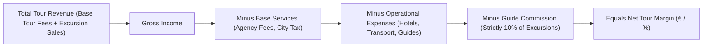

# 💶 Tours - Services, Revenue, Expenses & Calculation Logic

This document details the exact financial logic, cost structures, vendor calculations, and commission rules used by UNO ERP to compute tour profitability.

---

## 📊 **Financial Structure: Revenue vs Base vs Operational vs Expense**

UNO ERP categorizes tour finances into 4 core buckets:

### 1. **Revenue (`Income`)**
* **Base Tour Fee**: Fixed contract amount collected per passenger or per tour package.
* **Excursion Sales**: Gross cash collected from optional excursions sold to passengers (e.g. Dresden Tour, Mozart Concert, Danube Cruise).

### 2. **Base Services (`Included Core Contract Services`)**
* **Agency Fees**: Standard agency handling fees.
* **City Tax**: Municipal tourist taxes collected per person per night across cities.

### 3. **Operational Expenses (`Vendor Costs`)**
* **Hotel Accommodation**: Nightly costs charged by hotels across Prague, Vienna, and Budapest.
* **Transport / Bus Fees**: Daily rates charged by coach transport companies.
* **Guide Daily Fees**: Base daily wages paid to assigned tour guides.
* **Excursion Vendor Ticket Costs**: Admission/entrance ticket costs paid to attraction vendors.

### 4. **Guide Commission (Strict 10% Rule)**
> [!IMPORTANT]
> **10% Calculation Rule**: Guide commission is **strictly calculated as 10% of total excursion sales**.
> $$\text{Guide Commission} = \text{Total Excursion Sales} \times 0.10$$
> If no excursions are sold (or total sales $= €0.00$), Guide Commission is strictly **€0.00**.

---

## 🏨 **Hotel Pricing Basis: `Pax` vs `Room` Calculation**

Hotel costs in UNO ERP adapt dynamically depending on the master data setup for each hotel:

1. **`Pax Basis` (Per Person / Night)**:
   $$\text{Total Cost} = (\text{Pax Count} \times \text{Pax Rate}) \times \text{Nights}$$
2. **`Room Basis` (Per Room / Night)**:
   $$\text{Total Cost} = (\text{Single} \times \text{SingleRate} + \text{Double} \times \text{DoubleRate} + \text{Twin} \times \text{TwinRate} + \text{Triple} \times \text{TripleRate}) \times \text{Nights}$$

---

## ⚖️ **Net Tour Profitability Formula**

$$\text{Net Profit (€)} = \text{Total Revenue} - (\text{Base Services} + \text{Hotel Costs} + \text{Transport Costs} + \text{Guide Fees} + \text{Guide Commission} + \text{Excursion Vendor Tickets})$$
