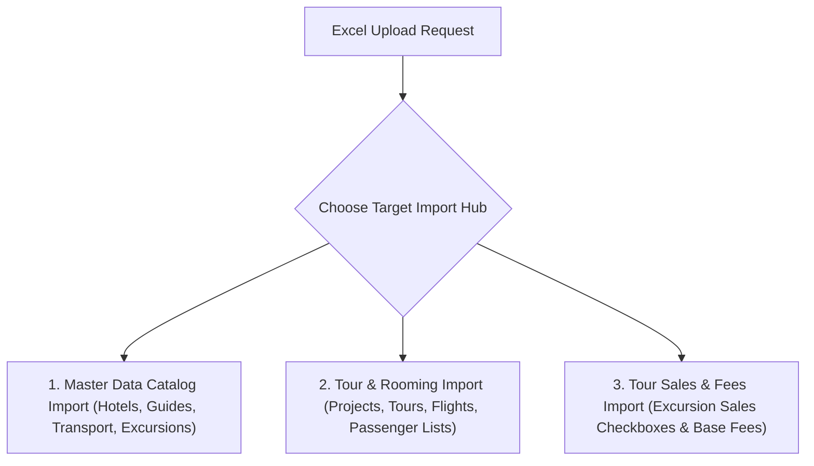

# 📊 Comprehensive Excel Import Master Guide (Projects, Tours, Rooming & Sales)

This comprehensive guide details all available Excel import capabilities, sheet specifications, filename rules, and automated database workflows in UNO ERP. It is structured to train both human operators and the AI Assistant on how every import scenario operates.

---

## 🎯 **Overview of Excel Import Capabilities**

UNO ERP supports **5 distinct import scenarios** through its multi-tier resilient Excel parsing engine:

---

## 📁 **Scenario 1: Importing a Brand New Project via Excel**

When a commercial project does not yet exist in the database, UNO ERP can **create the Project record automatically on the fly** during Excel import.

### **How to Specify a New Project**:
1. **Option A (Worksheet)**: Include a worksheet named **`Projects`** (or **`Project`**) with `ProjectCode` in cell A2 and `ClientName` in cell B2.
2. **Option B (Tour Sheet Column)**: In the **`Tours`** worksheet, set Column B (`Project`) to the new project name (e.g. `Orta Avrupa BVP`).
3. **Option C (Filename Prefix)**: Include the project name in the file name separated by an underscore (e.g. `Orta Avrupa BVP_BVP28082026_rooming.xlsx`).

### **System Action**:
* The system checks the database for an existing project with matching code or description.
* If no project is found, UNO ERP creates a new `Project` record on the fly:
  * `ProjectCode`: Extracted code/name.
  * `Description`: Full project name.
  * `ProjectStatusId`: `3` (**`Active`**).
  * `ClientId`: Default Client ID.

---

## 🚌 **Scenario 2: Importing a Brand New Tour via Excel**

Importing a new tour creates the Tour header record, sets flight details, and initializes status.

### **Worksheet Specifications (`Tours` / `Tour` / `TourData`)**:
* **Accepted Sheet Names**: `Tours`, `Tour`, `tour`, `tours`, `TourData`.
* **Column Layout (Row 1 Headers / Row 2 Values)**:
  * **Col A (`Cell 1`)**: `Tour Code` (e.g. `BVP28082026`, `PVB05072026`). *[Required]*
  * **Col B (`Cell 2`)**: `Project Code / Name` (e.g. `Orta Avrupa BVP`).
  * **Col C (`Cell 3`)**: `Destination` (e.g. `Prague-Vienna-Budapest`).
  * **Col D (`Cell 4`)**: `Arrival Date` (e.g. `28.08.2026` or `2026-08-28`).
  * **Col E (`Cell 5`)**: `End Date` (e.g. `04.09.2026`).
  * **Col F-I (`Cells 6-9`)**: `Adults`, `Children`, `Infants`, `Pax`.

### **Initial Tour Rules**:
> [!IMPORTANT]
> **Initial Tour Status**: Newly created tours are automatically initialized to `TourStatusId = 1` (**`Draft`**) on the Kanban Dashboard.

---

## 🔗 **Scenario 3: Importing a Tour for an Existing Project**

To link a new or updated tour to a project that already exists in UNO ERP:

### **Matching Logic**:
* Set Column B (`Project`) in the `Tours` sheet OR the filename prefix to the existing project code (e.g. `PRJ-BVP` or `Orta Avrupa BVP`).
* UNO ERP matches by:
  1. Exact `ProjectCode` equality (case-insensitive).
  2. Exact `Description` equality.
  3. Substring text match (e.g. `"BVP"` matching `"Orta Avrupa BVP"`).
* The new tour is directly linked (`tour.ProjectId = project.Id`).

---

## 👥 **Scenario 4: Importing Rooming & Booking Data for an Existing Tour**

When a tour already exists in the database, uploading an updated rooming list refreshes passenger records, family booking codes, and room numbers **without erasing existing hotel or guide service lines**.

### **Worksheet Specifications (`Rooming` / `Rooms` / `Passengers`)**:
* **Accepted Sheet Names**: `Rooming`, `Rooms`, `rooming`, `rooms`, `Passengers`, `PassengerList`.
* **Key Columns**:
  * **`Passenger Name`**: Full legal name.
  * **`Gender`**: `M` / `F`.
  * **`Pax Type`**: `Adult`, `Child` (or `CHD`), `Infant`.
  * **`Booking Ref`**: Family booking code (e.g. `BKG-01`, `BKG-02`).
  * **`Room Number`**: Assigned room number (e.g. `101`, `102`).
  * **`Room Type`**: `Single`, `Double`, `Twin`, `Triple`.

---

## 🎟️ **Scenario 5: Importing Excursion Sales & Base Fees (`Sales_import_template.xlsx`)**

Importing optional excursion sales checkmarks (`☑`) and base invoicing fees for passengers.

### **Prerequisite Rule**:
> [!IMPORTANT]
> **Passenger Prerequisite**: Passenger rooming lists **must be uploaded first** so passenger IDs exist in the database before uploading excursion sales.

---

## ⚙️ **The 4-Tier Resilient Scanning Engine Architecture**

If an uploaded Excel file does not follow standard template names, UNO ERP executes a **4-tier fail-safe scanning pipeline**:

1. **Tier 1 (Worksheet Name Match)**: Scans for sheets named `Tours`, `Tour`, `Projects`, `Project`, `Rooming`, `Rooms`.
2. **Tier 2 (Filename Parts Match)**: Splits filename by `_` or `-` (e.g. `Orta Avrupa BVP_BVP28082026_rooming.xlsx`) to extract `BVP28082026`.
3. **Tier 3 (Deep Cell Scan Across ALL Sheets)**: Scans rows 1-5 across **every worksheet** in the file for column headers `"Tour Code"`, `"Project"`, etc., reading the value from the row below.
4. **Tier 4 (Detailed Diagnostic Error)**: If Tour Code cannot be found, returns a detailed troubleshooting message listing all scanned worksheets and actionable file fix steps.
