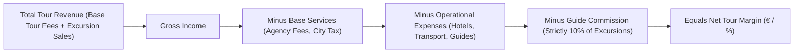

# 💶 Tours - Services, Revenue, Expenses & Calculation Logic

## 💡 Executive Summary & Financial Architecture
**UNO ERP** categorizes tour finances into 4 distinct buckets to provide real-time margin tracking and enforce operational governance:

---

## 📊 The Four Financial Buckets

### 1. Revenue (`Gross Income`)
* **Base Tour Fee (€)**: Fixed contract amount collected per passenger or as an overall package fee.
* **Excursion Sales (€)**: Gross cash collected from optional excursions sold to passengers on location (e.g. Dresden Tour, Mozart Concert, Danube Cruise).

### 2. Base Services (`Core Contract Inclusions`)
* **Agency Fees**: Contracted agency handling fees.
* **City Tax**: Municipal tourist taxes collected per person per night across cities.

### 3. Operational Expenses (`Vendor Direct Costs`)
* **Hotel Accommodation**: Room night costs charged by contracted hotels.
* **Transport / Bus Fees**: Daily coach rates charged by transport companies.
* **Guide Daily Fees**: Base daily wages paid to assigned tour guides.
* **Excursion Vendor Ticket Costs**: Admission and entrance tickets paid to third-party attractions.

### 4. Guide Commission (Strict 10% Rule)
> [!IMPORTANT]
> **Strict 10% Calculation Rule**: Guide commission is **strictly calculated as 10% of total excursion sales**.
> $$\text{Guide Commission} = \text{Total Excursion Sales} \times 0.10$$
> If no excursions are sold (or total sales $= €0.00$), Guide Commission is strictly **€0.00**.

---

## 🏨 Hotel Pricing Basis: `Pax` vs `Room` Calculation

Hotel accommodation expenses adapt dynamically based on the pricing basis configured in Master Data or customized on the Tour Service line:

### 1. `Pax Basis` (Per Person / Night)
Used when the hotel bills per guest:
$$\text{Total Cost} = (\text{Pax Count} \times \text{Pax Rate}) \times \text{Nights}$$

### 2. `Room Basis` (Per Room / Night)
Used when the hotel bills per room type occupied:
$$\text{Total Cost} = \left(\text{Single} \times \text{SingleRate} + \text{Double} \times \text{DoubleRate} + \text{Twin} \times \text{TwinRate} + \text{Triple} \times \text{TripleRate}\right) \times \text{Nights}$$

---

## ⚖️ Net Tour Profitability Formula

$$\text{Net Profit (€)} = \text{Total Revenue} - \left(\text{Base Services} + \text{Hotel Costs} + \text{Transport Costs} + \text{Guide Fees} + \text{Guide Commission} + \text{Excursion Vendor Tickets}\right)$$

$$\text{Net Margin (\%)} = \left(\frac{\text{Net Profit (€)}}{\text{Total Revenue (€)}}\right) \times 100$$

---

## 🛠️ Troubleshooting Financial Inquiries

* **Q: Why are hotel expenses not appearing in the tour services list?**  
  **A**: 
  1. Creating a Hotel in *Master Data* only registers the supplier contract. To attach expenses to a tour, go to **[Projects > Tour Detail](/projects)** and click **+ Add Hotel Stay** under the **Services & Costing** tab.
  2. Ensure the Category filter is set to **"All Categories"** or **"Hotel Stays"**.
  3. If the tour is marked **"Accounting Closed"**, newly added items are suppressed.

* **Q: Why is Guide Commission zero despite assigning a guide?**  
  **A**: Guide Commission applies only to optional excursion sales. If no excursion checkboxes are marked or excursion sales are €0.00, commission is €0.00. The guide's daily wage is recorded separately under *Guide Daily Fees*.
