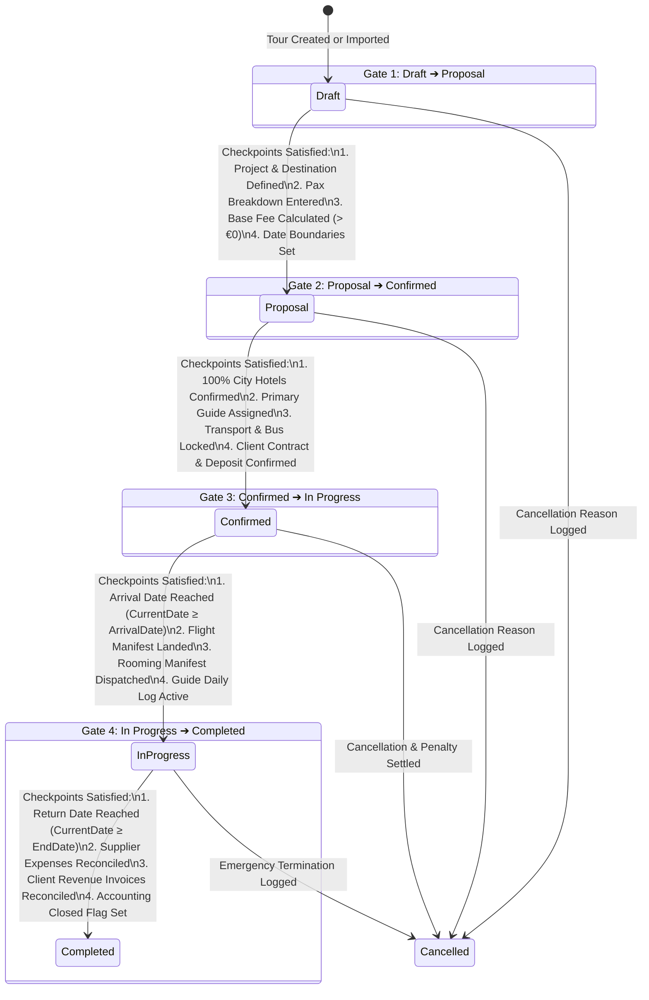

# 🚦 Tour Status Forward Transition Specifications & Gate Resolution Rules

## 💡 Executive Summary & Core Purpose
In **UNO ERP**, every tour moves through a strictly validated forward lifecycle across 5 stages (`Draft` $\rightarrow$ `Proposal` $\rightarrow$ `Confirmed` $\rightarrow$ `In Progress` $\rightarrow$ `Completed`), plus an exception terminal state (`Cancelled`).

Each transition is protected by mandatory **Checkpoint Gates** (`TourStatusCheckpointsController` & `TourCheckpointWidget`) to guarantee operational quality, zero unassigned resources, financial reconciliation, and SLA warning notifications.

---

## 🔄 State Machine & Transition Rules

---

## 🧭 Step-by-Step Gate Resolution Procedures

### 🔹 Gate 1: `Draft` ➔ `Proposal`
* **Business Goal**: Freezes initial tour itinerary and package price so sales personnel can issue formal proposal quotes to B2B Tour Operator Clients.
* **Mandatory Checkpoints**:
  1. **Project & Destination Defined**: Tour assigned to a valid Project with a destination route.
  2. **Pax Breakdown**: Adults, Children, and Infants entered.
  3. **Base Fee Calculated**: Base package fee ($> €0$) set in Tour Information.
  4. **Date Boundaries Set**: `EndDate > ArrivalDate`.
* **How to Resolve**: Open **Tour Detail** $\rightarrow$ **Tour Information** card $\rightarrow$ Click **Edit** $\rightarrow$ Enter Project, Destination, Dates, and Base Fee $\rightarrow$ Click **Save**.

### 🔹 Gate 2: `Proposal` ➔ `Confirmed`
* **Business Goal**: Guarantees that the tour is 100% operationally locked, fully backed by supplier reservations, and guaranteed to depart.
* **Mandatory Checkpoints**:
  1. **Hotel Reservations Confirmed**: At least 1 Hotel service assigned in the **Services** tab.
  2. **Guide Assignment Confirmed**: Primary Tour Guide assigned in Tour Info or Services tab.
  3. **Transportation & Coach Locked**: Transport Company or Driver assigned in Services tab.
  4. **Client Contract & Deposit Confirmed**: Either a **Base Fee (€)** is entered in Tour Info or an **Invoiced Fee** service is added under Services Revenue.
* **How to Resolve**:
  - Missing Hotel? Go to **Services** tab $\rightarrow$ Click **+ Add Hotel Stay**.
  - Missing Guide? Go to **Tour Info** $\rightarrow$ Edit $\rightarrow$ Select Primary Guide.
  - Missing Transport? Go to **Services** tab $\rightarrow$ Click **+ Add Transport Line**.
  - "Pricing / package fee not calculated"? Go to **Tour Info** $\rightarrow$ Edit $\rightarrow$ Enter **Base Fee (€)**.

### 🔹 Gate 3: `Confirmed` ➔ `In Progress`
* **Business Goal**: Marks active on-the-ground tour execution, daily guide operations, and real-time excursion sales.
* **Mandatory Checkpoints**:
  1. **Arrival Date Reached**: Current system date $\ge$ `ArrivalDate`.
  2. **Flight Manifest Verified**: Arrival flight code entered under **Tour Info ➔ Edit ➔ Flight Information** (e.g. `TK 1821`).
  3. **Rooming List Dispatched**: Final rooming list uploaded and dispatched.
* **How to Resolve**: Ensure arrival flight number is populated and departure date has arrived.

### 🔹 Gate 4: `In Progress` ➔ `Completed`
* **Business Goal**: Finalizes tour operations, seals financial accounts, and prevents further unauthorized expense edits.
* **Mandatory Checkpoints**:
  1. **Return Date Reached**: Current system date $\ge$ `EndDate`.
  2. **Supplier Expenses Reconciled**: All supplier costs (Hotels, Guides, Transport, Excursion Vendor tickets) recorded.
  3. **Client Revenue Invoices Reconciled**: Invoices issued and matched against client ledger.
  4. **Accounting Closed Flag Set**: Accounting administrator checks **"Accounting Closed / Locked"** flag in **Tour Info ➔ Edit**.
* **How to Resolve**: Enter all supplier expense lines, verify revenue, and check the "Accounting Closed" checkbox.

---

## 🛠️ Automated Time-Window Warning Notifications

The system continuously scans upcoming departures and triggers automated SLA warnings:
* **72h Prior to Departure**: Alerts if Hotel, Guide, or Transport reservations are unconfirmed.
* **48h After Return Date**: Alerts if Guide Cash Remittance is unsubmitted (enforcing Rule 4).
* **7 Days After Return Date**: Alerts if Accounting Closed flag remains unsealed.
