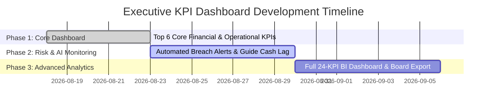

# UNO_ERP Executive KPI Dashboard Proposal

**24 High-Impact Key Performance Indicators for Tour Operator Excellence & Profit Optimization**  
*Prepared for the Executive Leadership & Owner of UNO | August 2026*

---

## Executive Summary

As a specialized Tour Operator & DMC managing complex multi-destination group tours across Central Europe (e.g. Budapest–Vienna–Prague), **UNO** requires complete operational visibility, tight risk governance, and real-time margin tracking. 

This proposal outlines **24 High-Impact Key Performance Indicators (KPIs)** organized into **4 Strategic Categories** to empower the owner of UNO to instantly identify operational bottlenecks, financial leakages, supplier inefficiencies, and growth opportunities.

---

## 1. Operational Efficiency KPIs (6 KPIs)

| KPI # | KPI Name | Target SLA | Calculation Formula | Strategic Value & Operational Impact |
| :--- | :--- | :--- | :--- | :--- |
| **KPI 1** | **Departure Readiness Gate Pass Rate (%)** | **100%** within 72h | `(Ready Tours / Total Upcoming Tours) × 100` | Prevents last-minute emergency calls, unassigned guides, or missing hotel rooming lists prior to tour departure. |
| **KPI 2** | **Rooming List Lock Accuracy (%)** | **> 98%** | `(Confirmed Roomings / Total Rooming Requests) × 100` | Eliminates single/double rooming errors, hotel check-in delays, and unexpected room surcharge penalties. |
| **KPI 3** | **Guide Capacity Utilization (%)** | **85% – 90%** | `(Assigned Tour Days / Contracted Days) × 100` | Maximizes top-tier guide productivity while avoiding burnout or idle retainer costs. |
| **KPI 4** | **Bus Seat Load Factor (%)** | **> 85%** | `(Total Passengers / Coach Seating Capacity) × 100` | Optimizes coach size selection (e.g. 35-seat vs 50-seat bus) to minimize transport cost per passenger. |
| **KPI 5** | **Supplier Confirmation Velocity (Hours)** | **< 24 Hours** | `Avg Hours from Booking Request to Supplier Confirmation` | Accelerates B2B client proposal turnaround and locks in competitive hotel group rates early. |
| **KPI 6** | **Automated Document Export Ratio (%)** | **> 95%** | `(System Vouchers & Manifests / Total Docs) × 100` | Saves operational staff 15+ hours weekly by automating PDF voucher & rooming list generation. |

---

## 2. Financial & Profitability KPIs (6 KPIs)

| KPI # | KPI Name | Target SLA | Calculation Formula | Strategic Value & Operational Impact |
| :--- | :--- | :--- | :--- | :--- |
| **KPI 7** | **Excursion Sales Penetration Rate (%)** | **> 75% Pax** | `(Passengers Buying Excursions / Total Pax) × 100` | Measures on-site sales conversion effectiveness and guide excursion promotion enthusiasm. |
| **KPI 8** | **Excursion Yield per Passenger (€)** | **> €120 / Pax** | `Total Excursion Revenue / Total Passengers` | Identifies high-performing tour itineraries and top revenue-generating optional excursions. |
| **KPI 9** | **Guide Commission Efficiency (%)** | **< 15% Margin** | `(Total Guide Commission Paid / Excursion Margin) × 100` | Ensures guide incentives drive profitable excursion sales while protecting net DMC margins. |
| **KPI 10** | **Cost per Pax Variance (€ & %)** | **± 2% Budget** | `Actual Settled Cost/Pax - Budgeted Cost/Pax` | Flags cost overruns in hotel night rates, city taxes, or entrance fees before final client settlement. |
| **KPI 11** | **Uninvoiced Service Cost Ratio (%)** | **< 1%** | `(Unbilled Supplier Costs / Total Expenses) × 100` | Prevents unbilled supplier expenses from slipping through without client re-invoicing. |
| **KPI 12** | **Gross Margin per Tour (€ & %)** | **> 22% Margin** | `((Total Revenue - Total Costs) / Total Revenue) × 100` | Provides the owner with instant visibility into which projects and tour series yield highest net profit. |

---

## 3. Governance, Compliance & Risk KPIs (6 KPIs)

| KPI # | KPI Name | Target SLA | Calculation Formula | Strategic Value & Operational Impact |
| :--- | :--- | :--- | :--- | :--- |
| **KPI 13** | **Guide Cash Remittance Lag (Days)** | **< 48 Hours** | `Avg Days from Tour End Date to Cash Bank Deposit` | Enforces Governance Rule 4 (*Separate Money Flows*) and accelerates cash flow collection. |
| **KPI 14** | **Excursion Cash Discrepancy Rate (%)** | **0.0%** | `\|Guide Cash Sales - Bank Deposit\| / Total Sales` | Detects cash leakages, currency conversion errors, or missing excursion receipts immediately. |
| **KPI 15** | **Unassigned Tour Resource Ratio (%)** | **0% within 7d** | `(Tours Missing Guide/Bus/Hotel / Total Tours) × 100` | Eliminates operational panics and quality degradation on upcoming departures. |
| **KPI 16** | **Passenger Data Completeness (%)** | **100% (7d prior)** | `(Pax with Valid Passport & Flight Info / Total Pax) × 100` | Prevents hotel check-in refusal and airport transfer miscommunication. |
| **KPI 17** | **Supplier Payment On-Time Rate (%)** | **> 98%** | `(Invoices Paid Within Credit Terms / Total Invoices) × 100` | Protects DMC reputation and secures preferred hotel room block allocations. |
| **KPI 18** | **Audit Trail Exception Count** | **< 5 / Month** | `Total Manual Price/Fee Overrides Logged in AuditLogs` | Ensures full administrative accountability and transparency across all financial overrides. |

---

## 4. Growth, Opportunities & AI KPIs (6 KPIs)

| KPI # | KPI Name | Target SLA | Calculation Formula | Strategic Value & Operational Impact |
| :--- | :--- | :--- | :--- | :--- |
| **KPI 19** | **Client Repeat Booking Rate (%)** | **> 80%** | `(Repeat Tour Operators / Active B2B Clients) × 100` | Measures long-term DMC client satisfaction and recurring contract stability. |
| **KPI 20** | **Project Pax Load Factor (%)** | **> 90%** | `(Actual Booked Pax / Contracted Capacity) × 100` | Helps negotiate volume discounts with hotels and transport providers. |
| **KPI 21** | **Top Destination Margin Share (%)** | **Monitor Mix** | `Gross Profit from Top 3 Cities / Total Gross Profit` | Identifies geographic expansion opportunities and high-yielding tour itineraries. |
| **KPI 22** | **Guide Performance NPS Score** | **> 4.8 / 5.0** | `Average Passenger Feedback Rating per Guide` | Ensures high tour quality, passenger delight, and positive repeat trip reviews. |
| **KPI 23** | **Pre/Post Hotel Night Conversion (%)** | **> 15% Pax** | `(Passengers Booking Extra Nights / Total Pax) × 100` | Unlocks easy high-margin hotel commission upsells for early arrivals. |
| **KPI 24** | **AI Copilot Instant Resolution Rate (%)** | **> 90%** | `(Queries Resolved by AI Copilot / Total Staff Inquiries) × 100` | Reduces onboarding time for new operators and answers how-to questions 24/7. |

---

## Implementation Roadmap

---

## Downloads & Deliverables

- **PowerPoint Presentation**: [`UNO_ERP_Executive_KPI_Dashboard_Proposal.pptx`](file:///C:/Ersen/Projects_2025/Uno_ERP/UserManuals/UNO_ERP_Executive_KPI_Dashboard_Proposal.pptx)
- **PDF Document**: [`UNO_ERP_Executive_KPI_Dashboard_Proposal.pdf`](file:///C:/Ersen/Projects_2025/Uno_ERP/UserManuals/UNO_ERP_Executive_KPI_Dashboard_Proposal.pdf)
