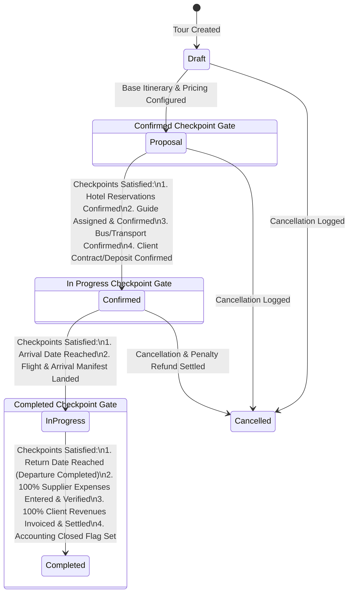
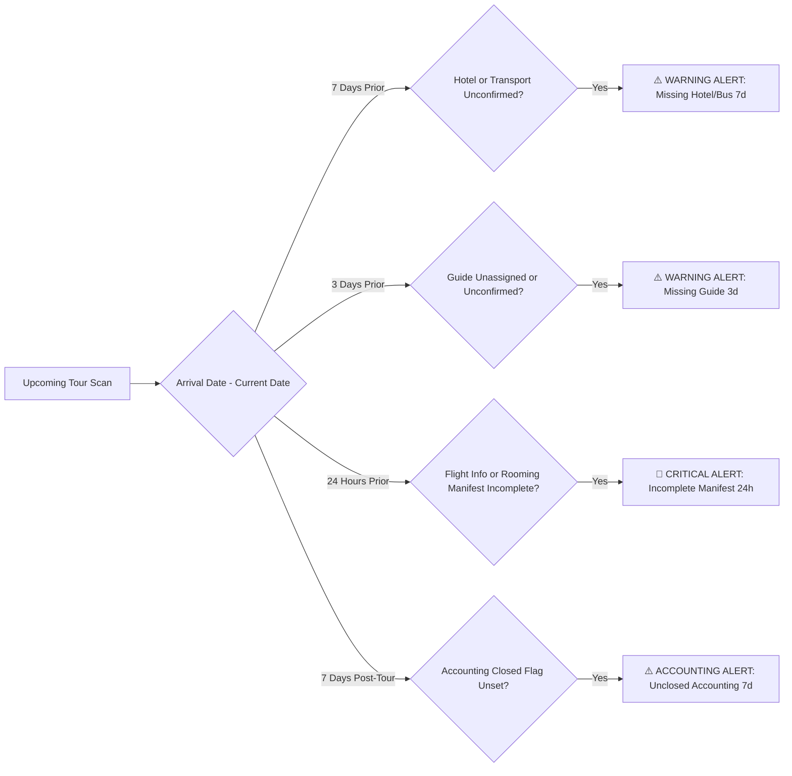

# UNO_ERP Tour Process Status Transition Criteria & Checkpoint Specification

**Action 1 Process Specification & Transition Checkpoint Rules**  
*Prepared for the Executive Leadership of UNO | August 2026*

---

## 1. Process Overview & State Machine Diagram

In **UNO_ERP**, every tour moves through a strictly defined lifecycle. Status transitions are governed by **Transition Checkpoint Rules** to guarantee operational quality, financial reconciliation, and zero missing resources.

---

## 2. Transition Criteria & Checkpoint Matrix

| Target Status | OrderIndex | Mandatory Checkpoints & Requirements to Transition | Failure Impact if Not Met |
| :--- | :---: | :--- | :--- |
| **Draft** | 1 | Tour record created, initial project assigned, estimated Pax count entered. | N/A (Initial State) |
| **Proposal** | 2 | Itinerary dates set, base services loaded, package rate calculated. | Cannot issue proposal quote to client. |
| **Confirmed** | 3 | **1. Hotel Checkpoint**: All city hotels reserved & confirmed. **2. Guide Checkpoint**: Primary guide assigned & accepted. **3. Transport Checkpoint**: Bus company & coach capacity locked. **4. Client Checkpoint**: Client contract signed / deposit received. | **BLOCKED**: Cannot lock tour operations or issue vouchers. |
| **In Progress** | 4 | **1. Arrival Date Checkpoint**: Current Date $\ge$ `ArrivalDate`. **2. Flight Manifest Checkpoint**: Passenger arrival flight & passenger list verified. **3. Rooming List Handover**: Rooming manifests dispatched. | **BLOCKED**: Cannot begin daily tour execution or guide cash issuance. |
| **Completed** | 5 | **1. Return Date Checkpoint**: Current Date $\ge$ `EndDate` (Passengers departed). **2. Expense Reconciliation**: 100% supplier costs (Hotels, Guides, Transport, Extras) entered & confirmed. **3. Revenue Reconciliation**: 100% billable items & invoices issued. **4. Accounting Closed Flag**: Financial audit status locked. | **BLOCKED**: Cannot archive tour or close financial balance. |
| **Cancelled** | 6 | Cancellation reason logged in `AuditLogs`, supplier cancellation penalties & refund adjustments settled. | Financial discrepancy on cancelled bookings. |

---

## 3. Automated SLA Warning Notification Rules

The system continuously scans upcoming departures and triggers automated SLA warnings when critical checkpoints are not met within designated time windows:

### SLA Warning Threshold Matrix

1. **7 Days to Departure (Hotel / Transport SLA)**:
   - *Condition*: `ArrivalDate - CurrentDate ≤ 7 days` AND (`HotelConfirmed == false` OR `TransportConfirmed == false`).
   - *Notification*: ⚠️ **"7 days to tour start ({TourCode}) but Hotel or Transport reservation remains UNCONFIRMED!"**

2. **3 Days to Departure (Guide SLA)**:
   - *Condition*: `ArrivalDate - CurrentDate ≤ 3 days` AND `GuideAssigned == false`.
   - *Notification*: ⚠️ **"3 days to tour start ({TourCode}) but NO Guide is confirmed!"**

3. **24 Hours to Departure (Passenger Manifest SLA)**:
   - *Condition*: `ArrivalDate - CurrentDate ≤ 1 day` AND (`ArrivalFlight == null` OR `PassportDataComplete == false`).
   - *Notification*: 🚨 **"24 hours to departure ({TourCode})! Passenger flight details or passport list is INCOMPLETE."**

4. **7 Days Post-Tour (Accounting Settlement SLA)**:
   - *Condition*: `CurrentDate - EndDate ≥ 7 days` AND `AccountingClosed == false`.
   - *Notification*: ⚠️ **"Tour {TourCode} returned 7 days ago but Accounting Closed flag is UNSET!"**

---

## 4. Copies & File Locations

- **PowerPoint**: [`Uno_Tour_Status_Transition_Process_Flows.pptx`](file:///C:/Ersen/Projects_2025/Uno_ERP/UserManuals/Uno_Tour_Status_Transition_Process_Flows.pptx)
- **PDF Document**: [`Uno_Tour_Status_Transition_Process_Flows.pdf`](file:///C:/Ersen/Projects_2025/Uno_ERP/UserManuals/Uno_Tour_Status_Transition_Process_Flows.pdf)
- **Markdown Specification**: [`Uno_Tour_Status_Transition_Process_Flows.md`](file:///C:/Ersen/Projects_2025/Uno_ERP/UserManuals/Uno_Tour_Status_Transition_Process_Flows.md)
