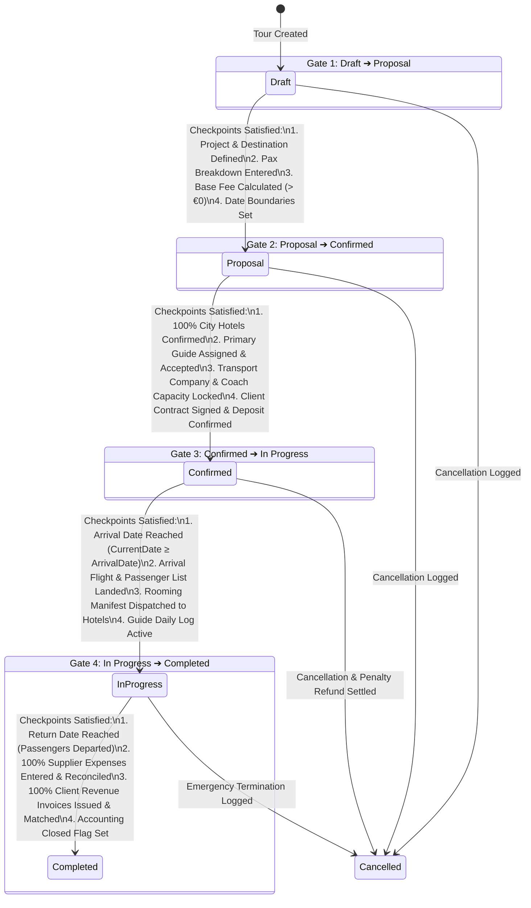
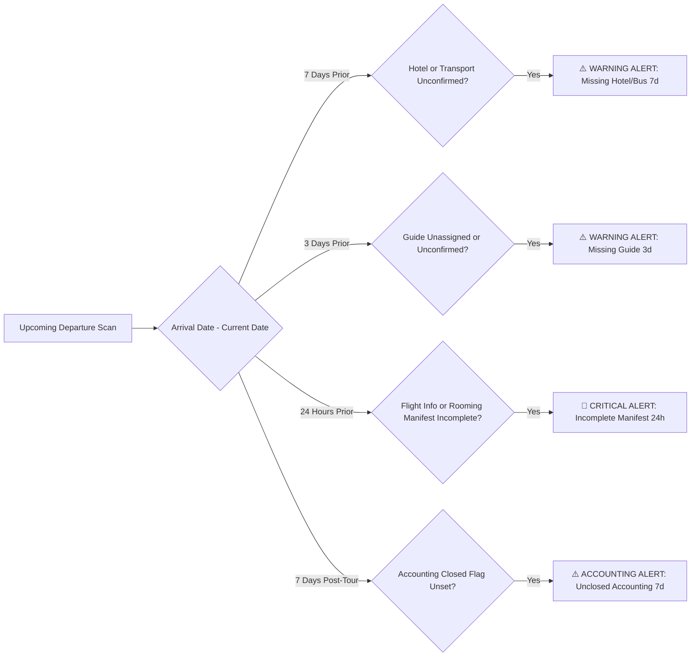

# UNO_ERP Tour Process Status Transition Criteria & Checkpoint Specification

**Action 1 Forward Transition Criteria Specification & Detailed Checkpoint Rules**  
*Prepared for the Executive Leadership of UNO | August 2026*

---

## 1. Process Overview & State Machine Diagram

In **UNO_ERP**, every tour moves through a strictly defined forward lifecycle. Each transition is protected by mandatory **Checkpoint Gates** to guarantee operational quality, zero unassigned resources, financial reconciliation, and SLA warning notifications.

---

## 2. Granular Forward Transition Specifications

### 🔹 Transition 1: Draft ➔ Proposal (OrderIndex 1 ➔ 2)
* **Business Purpose**: Freezes the initial tour itinerary and package price so sales personnel can issue formal proposal quotes to B2B Tour Operator Clients.
* **Automated System Checks**: `ProjectId != null`, `ArrivalDate != default`, `EndDate > ArrivalDate`, `Pax > 0`, `BaseFee > 0`.
* **Mandatory Transition Checkpoints**:
  1. **Project & Destination Definition**: Valid B2B Project Code assigned (e.g. `Orta Avrupa - BVP`) and destination routing configured.
  2. **Pax Breakdown & Pricing Engine**: Passenger breakdown entered (`Adults`, `Children`, `Infants`). Package pricing engine generates Base Fee (`BaseFee > €0`).
  3. **Itinerary Date Boundaries**: Arrival Date and End Date defined with valid non-zero duration (`EndDate > ArrivalDate`).
  4. **Initial Service Skeleton**: Base hotel, transport, and guide service templates instantiated in tour record.

---

### 🔹 Transition 2: Proposal ➔ Confirmed (OrderIndex 2 ➔ 3)
* **Business Purpose**: Guarantees that the tour is 100% operationally locked, fully backed by supplier reservations, and guaranteed to take place.
* **Automated System Checks**: `HotelConfirmed == true`, `GuideAssigned == true`, `TransportConfirmed == true`, `ClientDepositConfirmed == true`.
* **Mandatory Transition Checkpoints**:
  1. **Hotel Reservations Confirmed**: 100% of city stop hotels (Budapest, Vienna, Prague) have confirmed room reservations & vouchers issued.
  2. **Guide Assignment Confirmed**: Primary Tour Guide assigned, language requirements matched, daily rate accepted, and contract locked.
  3. **Transportation & Bus Locked**: Transport company & driver assigned. Coach capacity verified (e.g. 50-seat bus for 36 pax).
  4. **Client Deposit & Contract Confirmed**: Client B2B tour operator contract signed and initial deposit payment received in system.

---

### 🔹 Transition 3: Confirmed ➔ In Progress (OrderIndex 3 ➔ 4)
* **Business Purpose**: Marks active on-the-ground tour execution, daily guide management, and real-time excursion sales.
* **Automated System Checks**: `CurrentDate >= ArrivalDate`, `FlightManifestVerified == true`, `RoomingListDispatched == true`.
* **Mandatory Transition Checkpoints**:
  1. **Arrival Date Reached**: Current system date $\ge$ `ArrivalDate` (Arrival date threshold reached).
  2. **Flight & Arrival Manifest Landed**: Passenger arrival flight numbers & airport arrival list verified by DMC airport representative.
  3. **Rooming List Dispatched**: Final rooming lists handed over to hotel reception desks for smooth group check-in.
  4. **Guide Daily Operational Log Active**: Tour Guide checked in on-site and daily cash remittance tracker initialized.

---

### 🔹 Transition 4: In Progress ➔ Completed (OrderIndex 4 ➔ 5)
* **Business Purpose**: Finalizes tour operations, seals financial accounts, and prevents further unauthorized expense edits.
* **Automated System Checks**: `CurrentDate >= EndDate`, `UninvoicedSupplierCount == 0`, `AccountingClosed == true`.
* **Mandatory Transition Checkpoints**:
  1. **Return Date Reached (Passengers Departed)**: Current system date $\ge$ `EndDate`. Passengers departure transfer completed & flights departed.
  2. **100% Supplier Expense Reconciliation**: All supplier costs (Hotels, Guides, Transport, Excursions, Extras) entered & invoice-verified.
  3. **100% Client Revenue Reconciliation**: All client billable items & invoices issued and reconciled against client ledger.
  4. **Accounting Closed Flag Set**: Financial audit locked by Accounting Administrator (`AccountingClosed == true`).

---

### 🔹 Transition 5: Any Active Status ➔ Cancelled (OrderIndex 1-4 ➔ 6)
* **Business Purpose**: Safely handles cancelled departures, resolves supplier penalties, and prevents invalid revenue billing.
* **Automated System Checks**: `CancellationReason != null`, `SupplierPenaltiesCalculated == true`, `CreditNoteGenerated == true`.
* **Mandatory Transition Checkpoints**:
  1. **Cancellation Reason Logged**: Formal cancellation reason recorded in `AuditLogs` with user timestamp & administrator approval.
  2. **Supplier Cancellation Policy Check**: Hotel & transport cancellation penalty fees computed according to contractual SLAs.
  3. **Client Deposit Refund / Credit Note**: Client refund balance or credit note generated in Accounting ledger.

---

## 3. Automated Time-Window Warning Notifications

The system continuously scans upcoming departures and triggers automated SLA warnings when critical checkpoints are not met within designated time windows:

---

## 4. Deliverables & Copies

- **PowerPoint**: [`Uno_Tour_Status_Transition_Process_Flows.pptx`](file:///C:/Ersen/Projects_2025/Uno_ERP/UserManuals/Uno_Tour_Status_Transition_Process_Flows.pptx)
- **PDF Document**: [`Uno_Tour_Status_Transition_Process_Flows.pdf`](file:///C:/Ersen/Projects_2025/Uno_ERP/UserManuals/Uno_Tour_Status_Transition_Process_Flows.pdf)
- **Markdown Specification**: [`Uno_Tour_Status_Transition_Process_Flows.md`](file:///C:/Ersen/Projects_2025/Uno_ERP/UserManuals/Uno_Tour_Status_Transition_Process_Flows.md)
