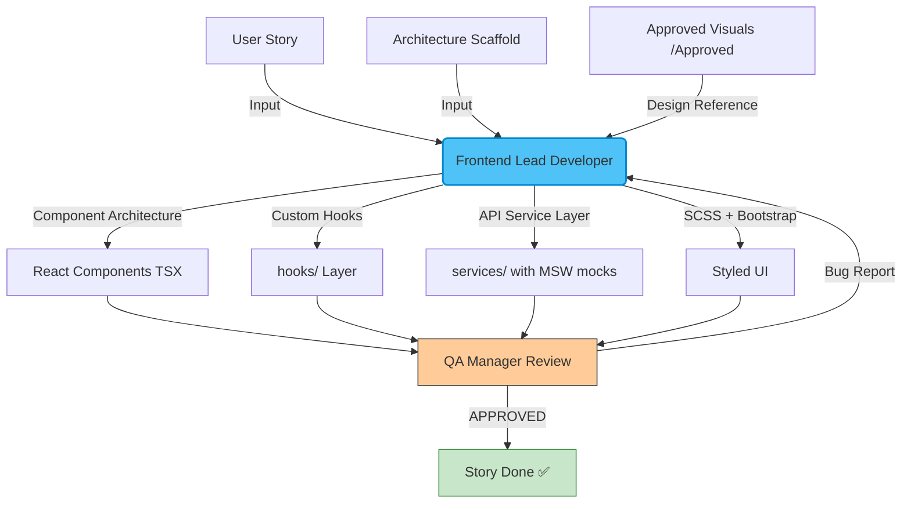

```mermaid
graph TD
    US[User Story] -->|Input| FLD(Frontend Lead Developer)
    TL[Architecture Scaffold] -->|Input| FLD
    VA[Approved Visuals /Approved] -->|Design Reference| FLD

    style FLD fill:#4fc3f7,stroke:#0288d1,stroke-width:2px;

    FLD -->|Component Architecture| COMP[React Components TSX]
    FLD -->|Custom Hooks| HOOKS[hooks/ Layer]
    FLD -->|API Service Layer| SVC[services/ with MSW mocks]
    FLD -->|SCSS + Bootstrap| STYLE[Styled UI]

    COMP --> QA[QA Manager Review]
    HOOKS --> QA
    SVC --> QA
    STYLE --> QA

    QA -->|Bug Report| FLD
    QA -->|APPROVED| DONE[Story Done ✅]

    style QA fill:#ffcc99,stroke:#333;
    style DONE fill:#c8e6c9,stroke:#388e3c;
```
